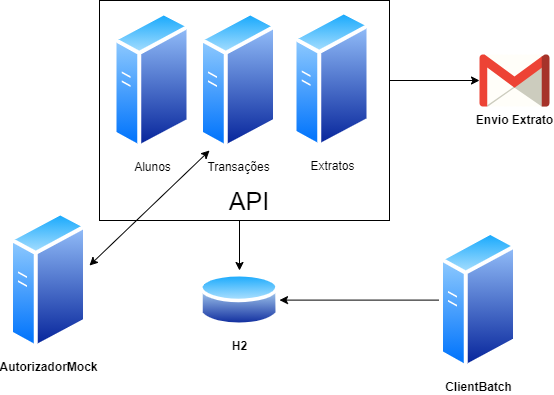

# 37SCJ -FIAP Credit Card
Projeto para disciplina Spring (FIAP)

A FIAP resolveu criar seu próprio cartão de crédito para ser utilizado pelos alunos e para isso necessita de um sistema para gerenciamento e integração com outras empresas. 

##  Pré-requisitos para execução do projeto
- Tecnologias necessárias.

  1- Para executar os projetos é necessário ter instalado Java SE Development Kit versão 11 e o Node JS.
  
  2- Utilizar uma IDE para execução dos projetos de API e Batch desenvolvidos em Java. Ex. IntelliJ ou Eclipse.
  
  3- Utilizar uma IDE para execução do projeto Autorizador densenvolvido em NodeJS. Ex. Visual Code
  
  ---
## Topologia

---

## Download do projeto

- Baixar o projeto: `$ git clone https://github.com/teixeira308/fiapcreditcard.git`

---
